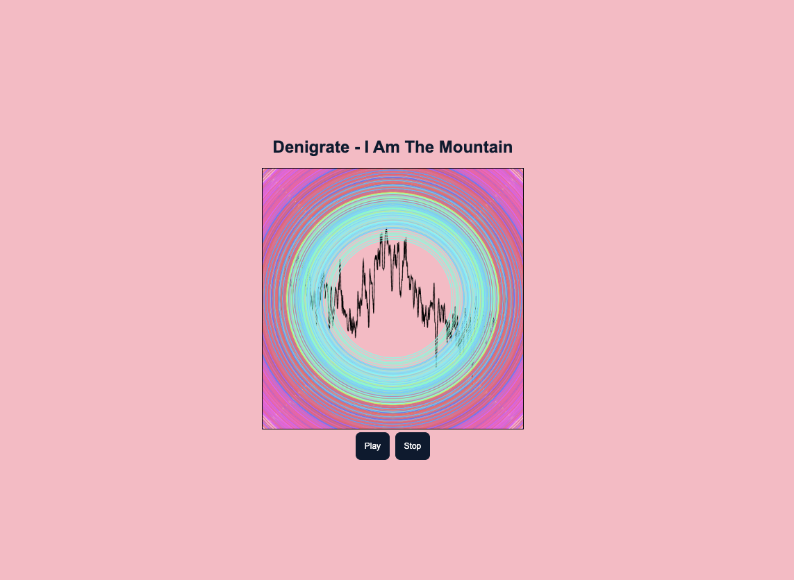

# ACS 4310 Audio Visualizer

This project is an audio visualizer built with JavaScript, where real-time audio data is displayed using a canvas. The visualizer takes an array of audio frequency data and transforms it into a visual representation on the canvas. The audio used is a song called Denigrate by Calgary band I Am The Mountain.

## Features

1. Uses the canvas element to display data.
2. Draws data in real-time.
3. Implements data normalization techniques.

## To run

To run the project, follow these steps:

1. Clone the repository to your local machine.
2. Open the project files in your preferred code editor.
3. Start a local server to run the project (e.g., using Live Server in VSCode).

